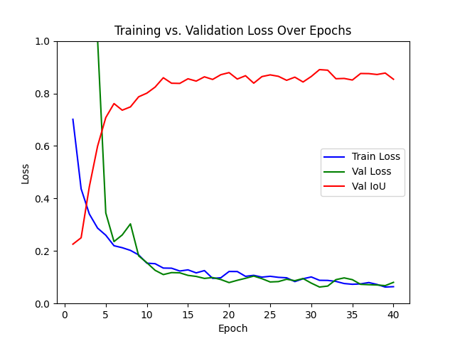
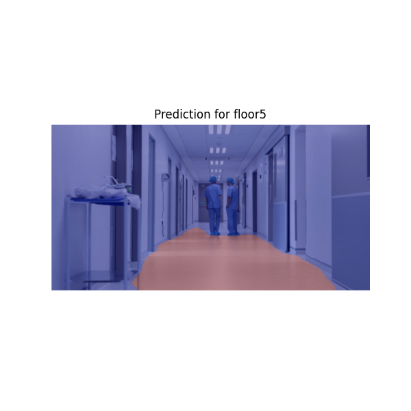

## Robotic Vision Project: 
Train convolutional neural networks for ground-plane segmentation and navigation planning. Model specified and fine-tuned for hospital environment use (hospital specific navigation).

## Steps: 
1. Data collection & labeling
2. Model selection for CNN & training
3. Inference script and fine-tuning 
4. Adapt script for video use: real robotic vision prototype 

## Current Metrics:

### Convergence: 

### Example of model ground plane segmentation (best epoch so far): 
